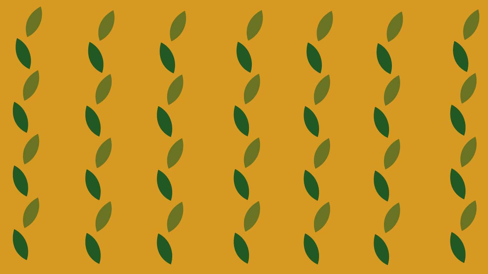

<h1>Happy Leaf</h1>
 

Happy Leaf is a website dedicated to providing a platform for individuals interested in embracing an eco-friendly lifestyle. It serves as a judgment-free zone where people can freely explore and share insights on sustainable living.  
The focus of Happy Leaf is on positive change, personal growth, and collective commitment to building a healthier and happier world in harmony with nature. The website is meant to encourage individuals on the journey towards a greener, more eco-conscious life.  
The website targets people interested in learning more about an eco-friendly lifestyle, catering to both those just approaching it and individuals already immersed in it. The focus is also on Ireland, aiming to keep the people of this country informed about initiatives. However, many articles can be a valuable source for everyone. The blog section features three main types of articles: eco-tips, vegan recipes, and information on sustainable practices in Ireland.

 

<h1>Project Goals and Stories</h1>
<h2>Project Goals</h2>
- As a user I want to: 
  - easily and intuitively navigate the website 
  - browse the website to be able to find the information I am looking for 
  - be able to find information through different devices 
  - be able to interact with the interface and receive feedback 
  - be able to recognise a brand to come back to visit the website again 
  - create an account on the website and join the community 
  - search for blog posts and information I need 
  - get in touch with the admin of the page 
 
<h2>Epics and User Stories</h2>
<a href="https://github.com/MidoriSusanna/Happy-Leaf/issues?q=is%3Aissue+is%3Aopen">Full list of User Stories available here</a> 
<a href="https://github.com/MidoriSusanna/Happy-Leaf/milestones">Full list of Epics available here</a> 

<h1>Agile Development</h1>

I utilized GitHub Issues and Projects for writing and managing user stories and epics. The Kanban board was employed to categorize stories into Todo, In Progress, and Done columns. Additionally, I applied the MoSCoW method to label stories as Must-Have, Could-Have and Should-Have.
 
<a href="https://github.com/users/MidoriSusanna/projects/1">Kanban Board</a> 

<h1>Design an User Experience</h1>
 

Happy Leaf is a website designed with sustainability in mind. The layout is crafted to be easy on the eyes and welcoming, providing users with a sense of being invited and facilitating a smooth start to their journey. The chosen colors are reminiscent of nature, particularly autumn shades. The font is simple yet playful at times, striking a balance to effectively convey a serious message.

 
<u>Fonts: </u> 
- Comfortaa for main titles  
- PT Sans for paragraphs  
<u>Colour Palette:</u>  
 
White was left also as a colour to emphasize and keep some parts of the website clearer.  
<u>Customize background:</u>
 

A customise background with leaves has been made to provide even more the sense of balance and harmony in the layout. This bacjground appears in the index.html page and as a constant in all the pages related to authentication.
 
 
<h2>Wireframes</h2>

Wirefranes were created by me using Adobe Illustrator for both Dekstop and Phone:
 
<a href="/Users/susi/Desktop/Django Project/Happy-Leaf/WIREFRAMES.md">Wireframes for dekstop here</a>
 
<a>Wireframes for phone here</a>

