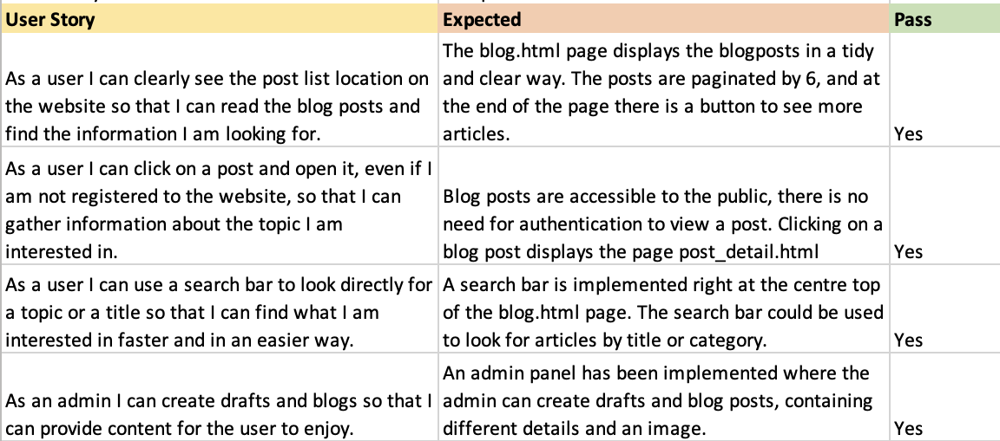
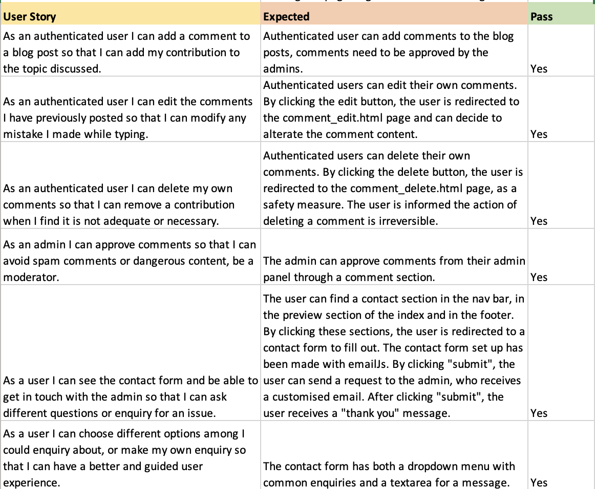
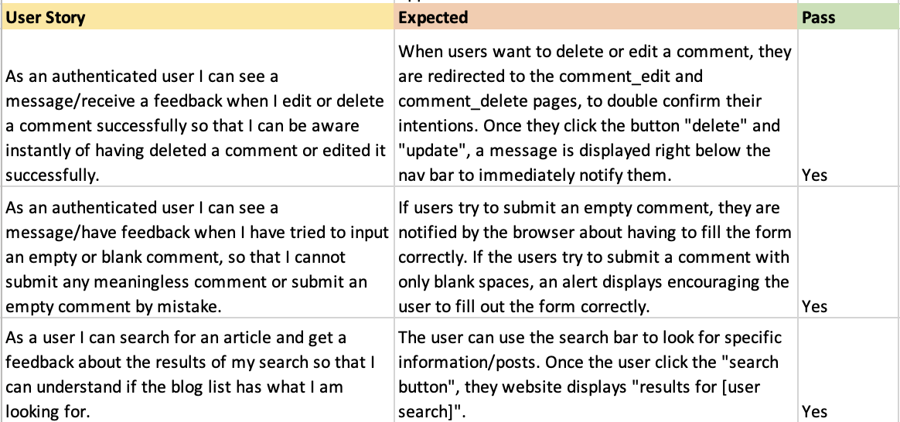
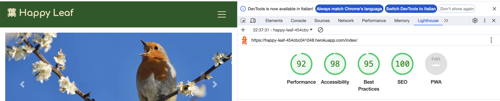

# Manual Testing

# Validation

## HTML

Each page has been validated with [W3 Validator](https://validator.w3.org/), only warnings about the h1 tag have been found, but no errors.Info pop ups have also been found about the hr tag.

- Index.html:

- About.html:

- Blog.html:

- Contact.html:

The type warning is related to the script added to use emailJs. 

- Log-in, Log-out, Sign-up:

- Delete and edit comment pages:

- Post_detail.html:

In the post_detail.html page 42 errors and warnings have been found. Those errors are related to the installation of SummerNote. 

# CSS

The custom css page has been validated with [W3C Validator](https://jigsaw.w3.org/css-validator/) and no errors have been found.

# JS

The emailJs file has been validated with [JShint](https://jshint.com/) and no errors were found. Some warnings related to the use of let as a variable were found.

# Python

The project follows the PEP8 style guidelines and passes the [CI Phyton Linter](https://pep8ci.herokuapp.com) with no errors. 
The files settings.py and env.py have not undergone validation against the PP8 standards to prevent any potential disruptions to the application's functionality. These files are critical to the app's operation, and I opted to not modify them to ensure stability.

- Manage.py:

- Admin.py:

- Apps.py:

- Forms.py

- Models.py

- Url.py (Blog):

- Views.py:

- Asgi.py:

- Urls.py (Happy Leaf):

- Wsgi.py:

# Lighthouse report

- Index.html:

- About.html:

- Blog.html:

- Contact.html:

- Log-in, Log-out, Sign-up:

- Delete and edit comment pages:

- Post_detail.html:

# Responsiveness

The website is fully responsive across various screen sizes including desktops, tablets, and phones. Several modifications have been implemented to enhance user experience. Examples include the addition of a hamburger menu for the navigation bar, removal of one section in the footer, elimination of subtitles in the carousel for smaller screens, and exclusion of pictures in the post detail section.

# Colour contrast

The website was tested for colour contrasts with [WAVE](https://wave.webaim.org) to improve accessibility, no low contrast areas were found. 