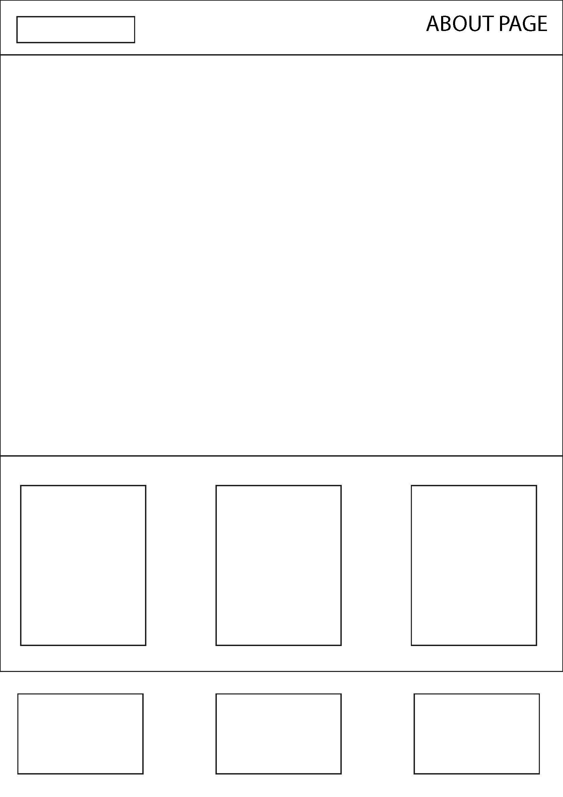

# Wireframes 
**Main Page**

**About Page**

**Blog Page**

**Post Detail Page**

**Contact Page**

**Authentication pages**

The version of the website for smaller screens undergoes several layout changes: an important one is the navbar, which transitions into a hamburger icon positioned on the right side of the screen. The horizontal elements (e.g., "Meet the Team," "Preview" sections) are rearranged vertically. The footer loses its left element. The carousel removes the subtitles. All other elements are scaled according to the screen size.
