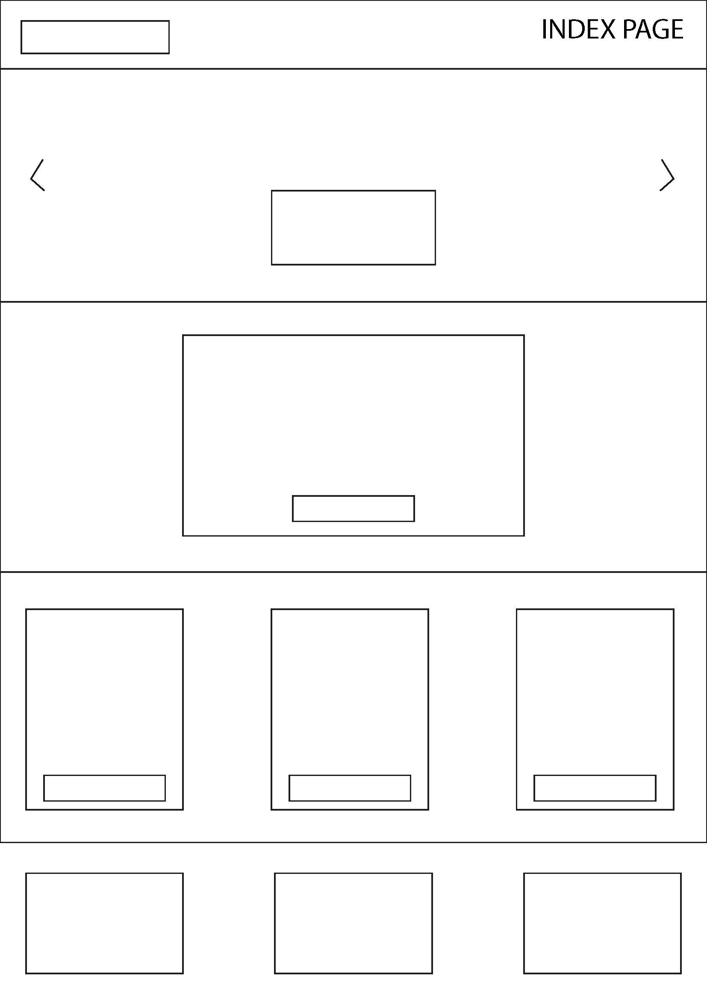
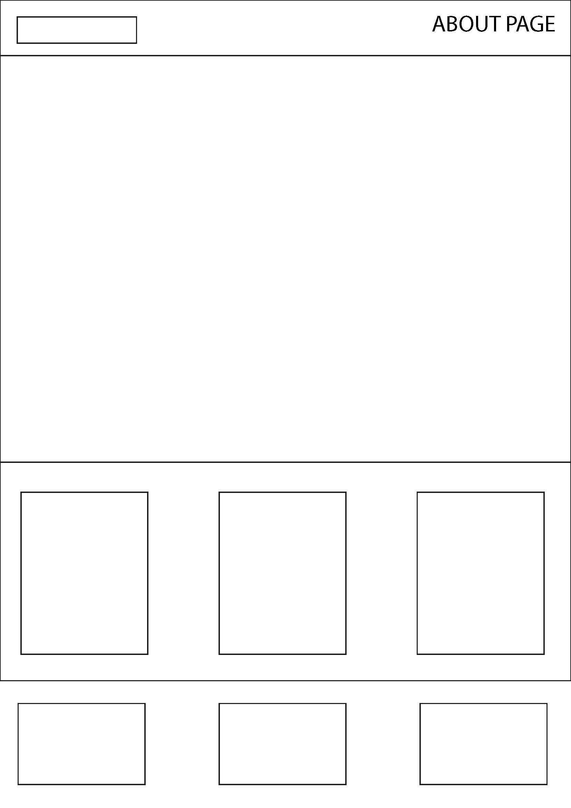

<h1>Wireframes for dekstop</h1>
<h2>Main Page</h2> 

<h2>About Page</h2> 

<h2>Blog Page</h2> 

<h2>Post Detail Page</h2> 

<h2>Contact Page</h2> 

<h2>Authentication pages</h2> 

 
<h1>Wireframes for phone</h1>

